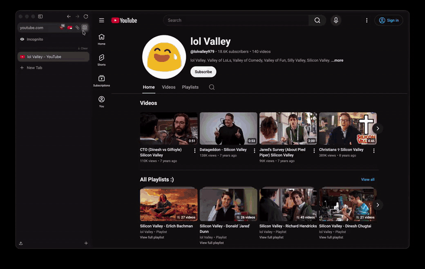
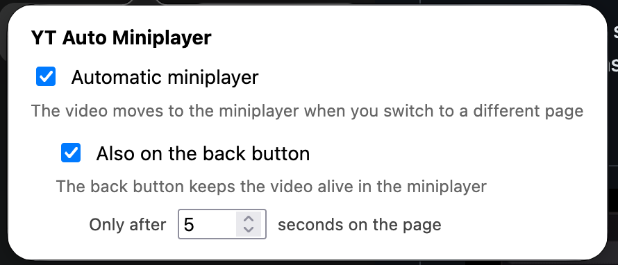

# YT Auto Miniplayer

A Firefox and Chrome extension. It opens the YouTube miniplayer when you navigate away or press back and keeps playing.

## Demo



[The MP4 file of demo](docs/media/demo.mp4)

## Install the release

The extension is not in the Firefox or the Chrome store yet. Download
the ZIP file, then load it by hand.

1. Open the
   [Releases page](https://github.com/markkyaw/yt-auto-miniplayer/releases/latest).
2. Download the latest `.zip` from **Assets**.

### Firefox

1. Open `about:debugging#/runtime/this-firefox`.
2. Select **Load Temporary Add-on**.
3. Select the ZIP file. You do not need to open it first.

Firefox removes a temporary add-on when it closes. Load it again after
each restart.

### Chrome

1. Open the ZIP file. It makes a folder that holds `manifest.json`.
2. Open `chrome://extensions`.
3. Turn on **Developer mode**.
4. Select **Load unpacked**, then select that folder.

Chrome keeps the extension after a restart. Keep the folder in place.
Chrome reads it at every start.

## Install from the source

Clone the repository, then follow the steps above. Give Firefox the
`manifest.json` file in this folder, and give Chrome this folder.

## Turn the extension on or off



Select the toolbar button. The popup shows two switches and one field.

| Control                          | Effect                                                                    | Default |
| -------------------------------- | ------------------------------------------------------------------------- | ------- |
| Automatic miniplayer             | The video moves to the miniplayer when you switch to a different page     | On      |
| Also on the back button          | The video moves to the miniplayer when you press the back button          | On      |
| Only after N seconds on the page | The back button acts only when you stayed on the watch page longer than N | 5       |

The extension can be turned on/off by toggling the first checkbox

The seconds rule applies to the back button only. A link click opens
the miniplayer at once. A value of 0 turns the minimum off.

A change applies at once. You do not need to reload the page.

## Run the tests

```
node --test
```

The tests need no installation. The project has no dependency.

## Build the file to upload

```
./tools/package.sh
```

The script runs the unit tests, checks that every file the manifest
names exists, and writes `dist/yt-auto-miniplayer-<version>.zip`. The
version comes from `manifest.json`. That ZIP file is the one to attach
to a GitHub release.

The ZIP file holds `manifest.json` at the top level, with `src/`,
`icons/`, and `popup.html`. It leaves out `docs/`, `test/`,
`support/`, `tools/`, and the git data.

Upload the same file to a GitHub release, and later to both stores:

- Firefox: addons.mozilla.org → Submit a New Add-on.
- Chrome: the Developer Dashboard → Add new item.

## Where the extension runs

The content script runs on `www.youtube.com` and `youtube.com` only.
It does not run on `music.youtube.com`, `m.youtube.com`, or
`studio.youtube.com`.
